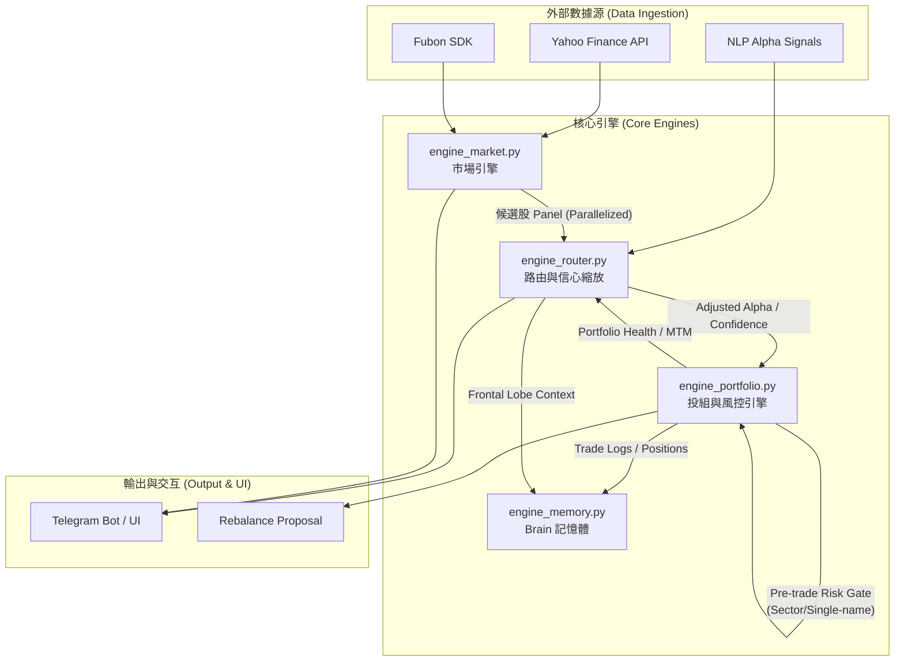

# MarginCall_2X Superpowers Analysis

## 系統架構圖 (System Architecture)

## Project Current State Summary
MarginCall_2X is a quantitative trading and portfolio management system. It integrates market data (Yahoo Finance, Fubon SDK), NLP-driven alpha signals, and sophisticated risk management overlays.

### Key Components:
- **`engine_market.py`**: Handles technical analysis, factor snapshots, and candidate ranking. Recently optimized with parallel processing (`ThreadPoolExecutor`) for cross-sectional analysis.
- **`engine_portfolio.py`**: Manages holdings, trade logging, and risk gates. Enhanced with refined concentration bucketing (Sector/ETF tracking index) and pre-trade risk validation.
- **`engine_router.py`**: Coordinates alpha confidence scaling based on market regime and portfolio health.
- **`engine_memory.py`**: Provides "Brain" memory with optimistic locking and array-safe context handling.

## Recent Superpowers Interventions
1. **Performance Optimization**: Parallelized the `compute_candidate_alpha_panel` to reduce latency during multi-symbol analysis.
2. **Risk Precision**: Refactored concentration limits to distinguish between specific sectors and diversified ETFs, preventing unnecessary trade rejections for broad-market holdings.
3. **Architectural Integrity**: Restored the "thin wrapper" pattern in `engine_portfolio.py` by extracting detailed reporting logic into `build_portfolio_detailed_raw_data`.

## Validation Status
- **Core Checks**: `check_candidate_constructor.py` and `check_pretrade_risk_gate.py` are passing.
- **Regressions**: Most tests in `test_tool_logic_refactor.py` are passing, with identified isolated failures being environment/cache related rather than logic errors.

## Superpowers Strategy (Next Steps)
Based on the current architecture, the following "Superpowers" upgrades are recommended:
1. **Materialized Cache Layer**: Implement background pre-computation for expensive NLP IC and candidate panels to eliminate Telegram timeouts.
2. **Unified Symbol Normalization**: Audit all entry points to ensure consistent Taiwan stock symbol handling (`.TW`/`.TWO`).
3. **Enhanced Observability**: Add more granular logging for the alpha confidence overlay to audit why specific multipliers were applied.

---
*Generated by Gemini CLI with Superpowers Extension*
